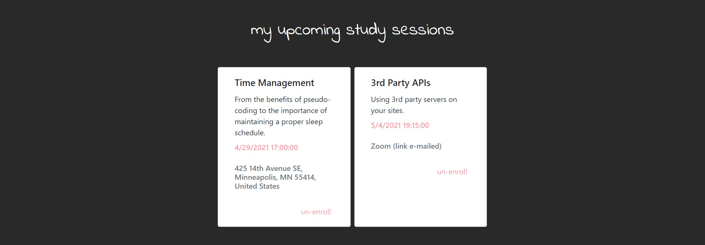
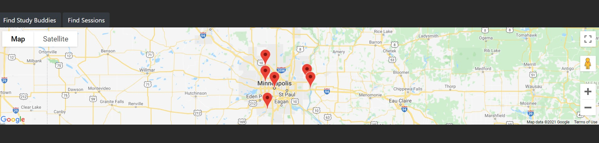
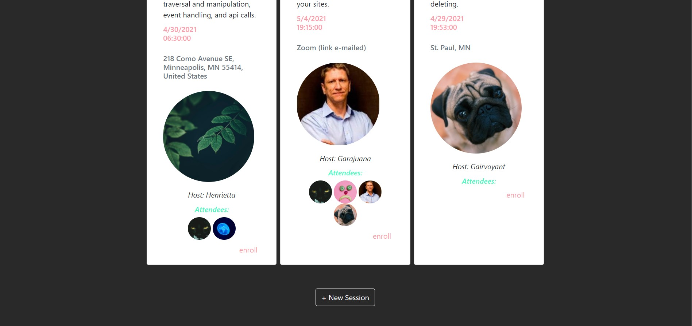
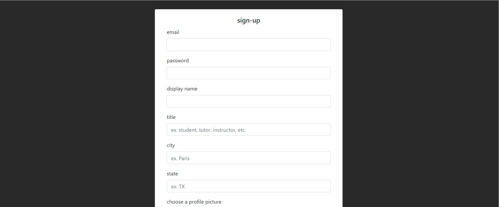

# Study Buddy

## Description
Study Buddy is an app that allows a signed-in user to view their notes and upcoming study sessions from their dashboard. In the upcoming sessions page, they can view study sessions being hosted or add their own study session for people to sign up to attend.

## MVP
*The MVP for this project was a site that allowed users to sign up, sign in, logout, view their sessions and notes, and view all sessions.*

## User Story
```
AS A student I WANT TO manage my upcoming study sessions and notes SO THAT I can easily set up times and locations with my peers.
```

## Usage
* To create an account, a form will appear to fill out. After signup, the user is redirected to their dashboard where they can add notes. After login, the user is also redirected to the dashboard which could be filled with upcoming sessions they're hosting, attending, and their notes. They can also create notes here via the add note button. The dashboard is also where they can delete or unroll from sessions. 

* On the study sessions page, users can view and enroll in upcoming sessions. They can also add sessions via the add session button.

* The find a buddy tab will open up a map that can access either study sessions or other study buddies by location.

* At the end of their visit, the user can logout.

## Links
[Github Repo](https://github.com/najuasaad/StudyBuddy)

[Heroku App](https://mysterious-bayou-93387.herokuapp.com/)

## Screenshots













## Contributors

* Eric Heltemes

* Henry Kariuki

* Kelsie Lewis

* Saranya Dayalan

* Najua Saad